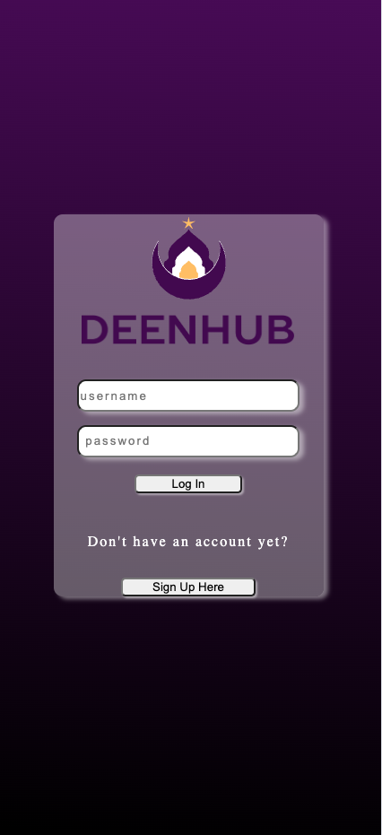
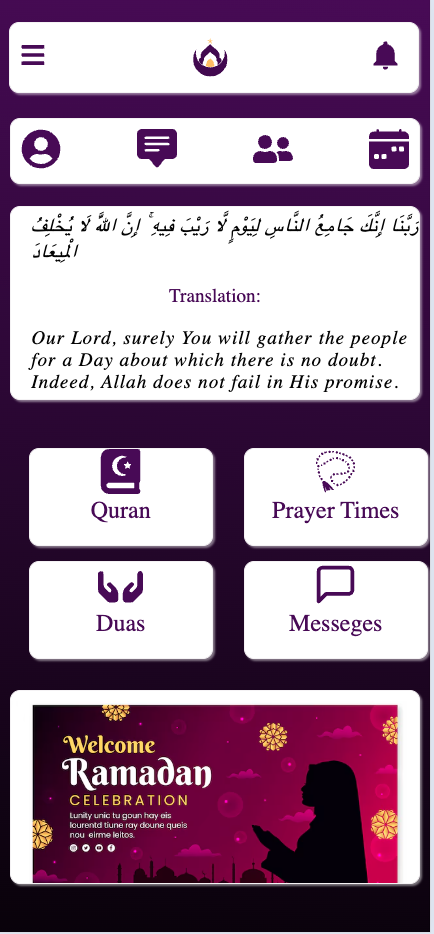
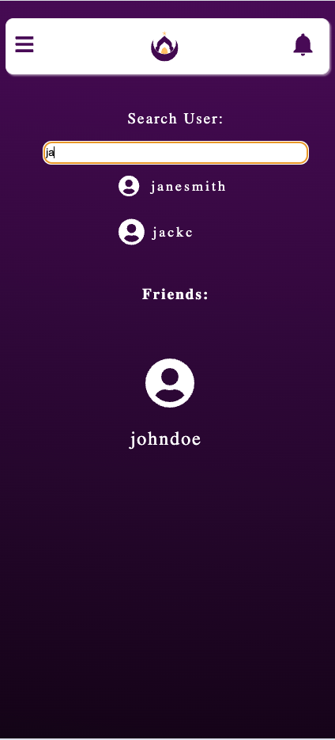
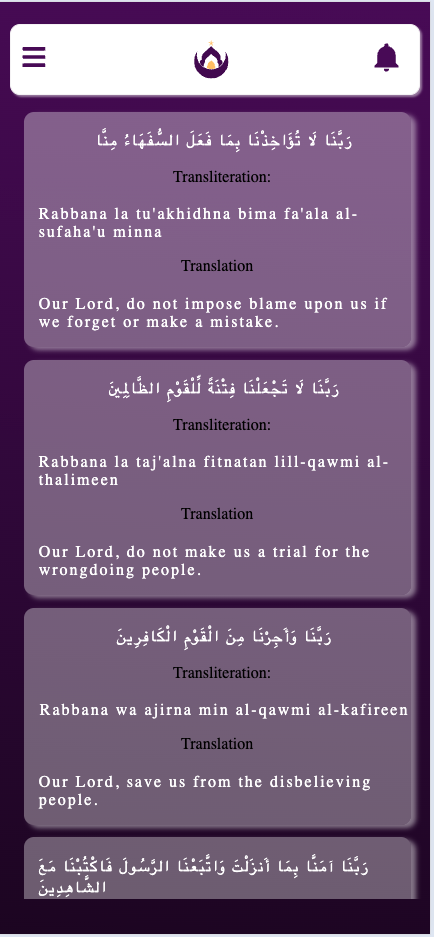
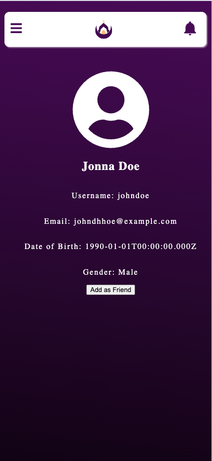
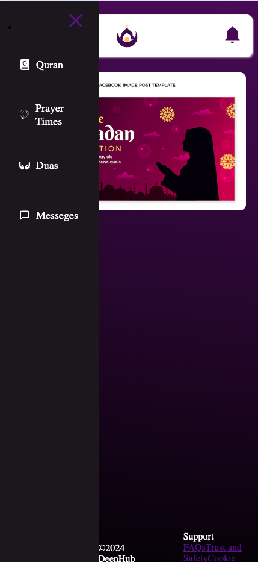

# QadrPath - Muslim Social Media App

## Description

QadrPath is a Muslim social media app designed to connect Muslims around the world. Users can share posts, create events, send messages, and build communities.

## Features

- User authentication and authorization
- User profile customization
- Post creation and interaction (likes, comments)
- Event creation and management
- Messaging system
- Friendships and group interactions
- Location-based services
- Responsive design for mobile and desktop

## Technologies Used

- React.js for the frontend
- Node.js and Express.js for the backend
- MongoDB for the database
- Socket.io for real-time messaging
- Axios for API requests
- React Router for navigation
- Material-UI for UI components
- JWT for authentication
- Geolocation APIs for location-based features

## Planning

.png)

## WireFrame 

## Installation

1. Clone the repository:

git clone https://github.com/your/repository.git

2. Install dependencies:

npm install
npm i axios 

## API Endpoints

The application provides the following API endpoints:

1.GET /users: Get all users

2.POST /users: Create a new user

3.PATCH /users/:id: Edit user profile

4.DELETE /users/:id: Delete user profile

## contact 
- Itzel Alwarafi ([Github](https://github.com/itzelalwarafi) | [LinkedIn](https://www.linkedin.com/in/itzelalwarafi/))
